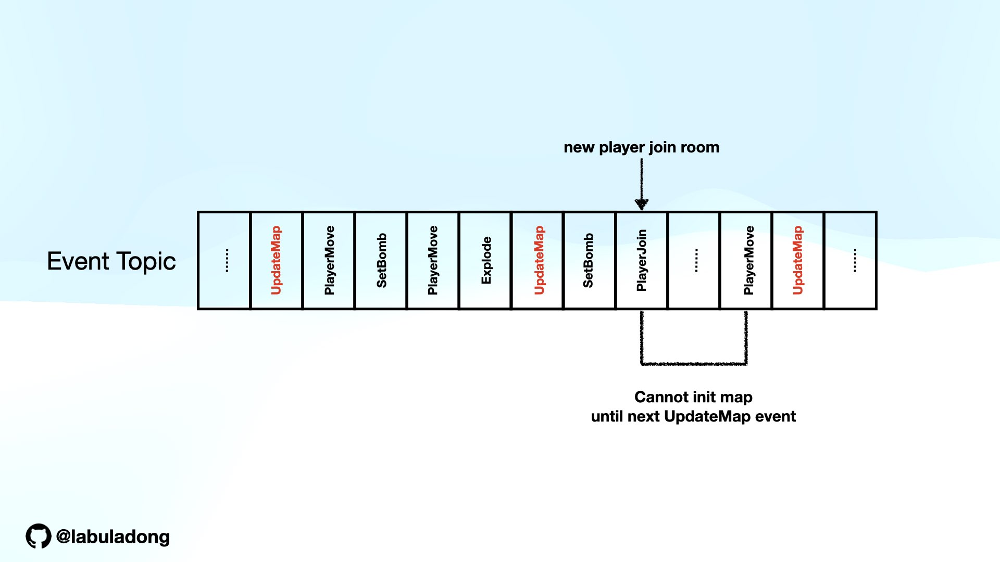
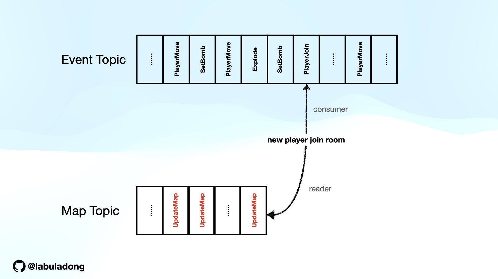
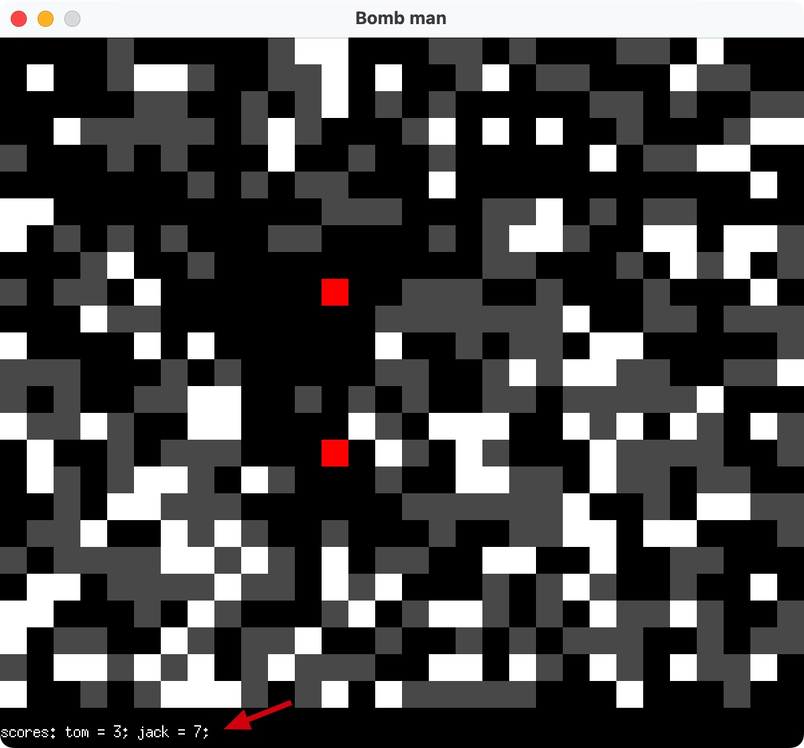

之前说了，每个游戏客户端包含一个 Pulsar 生产者和一个 Pulsar 消费者。

游戏中所有玩家动作都会被抽象成一个事件，游戏客户端会监听本地键盘的动作并生成对应的事件，由生产者发送到 Pulsar 消息队列里；同时每个游戏客户端的消费者会不断从 Pulsar 中拉取事件并把事件应用到本地，从而保证所有玩家之间的视图是同步的。

但玩家间的同步只是一个多人游戏最基本的要求，我之前列出了诸如房间、计分板等很多功能，下面我们看看如何仅仅利用 Pulsar 的各种 feature 来实现。

### 如何实现游戏房间

我们的游戏需要「房间」的概念，在相同房间里的玩家才能一起对战，不同房间之间不能互相影响。

这个需求可以用 Pulsar 的 topic 来实现。一个游戏房间就是一个 topic，相同房间的玩家会连接到相同的 topic 中，所有事件的生产和消费都会在相同的 topic 中进行，从而做到不同房间的隔离。

### 如何实现推炸弹

为了提升游戏的操作难度和趣味性，我们允许玩家推炸弹。


这其实就是允许让炸弹移动，和玩家移动是一样的，我们也可以把炸弹的移动抽象成一个事件：

```go
// 炸弹移动的事件
type BombMoveEvent struct {
	bombName string
	pos      Position
}
```

当玩家碰到炸弹的时候，向消息队列持续发送炸弹移动的事件即可。

### 如何定时更新房间的地图

地图中的障碍物是随机生成的，障碍物分为可摧毁的和不可摧毁的两种类型。考虑到可摧毁的障碍物会被玩家炸掉，我们需要给每个房间定时更新新的地图。


这个功能稍微有点难办。可能你会说，也可以把更新地图的动作抽象成一个事件（事实上我也是这样做的）：

```go
type UpdateMapEvent struct {
    // 这个列表存储所有障碍物的坐标
	Obstacles []Position
}
```

但这有两个问题：

**1、由谁来发送这个更新地图的事件**？

要知道我们的后端只有 Pulsar 消息队列，你无法在后端写代码实现一个定时器定期给 topic 中发送消息的。

> PS：实际上 Pulsar 也能提供一些简单的计算功能，也就是 Pulsar Function，我会在后面介绍。

那么我们只能把更新地图的逻辑写在前端（游戏客户端），但这里还有问题。假设有 3 个在线客户端，每个客户端都每隔 3 分钟发送一次更新地图的命令，那么实际上就是每 1 分钟更新一次地图了，这显然是不合理的。

所以我们需要在多个客户端之间进行类似「**选主**」的逻辑，保证只有一个 leader 客户端持有更新地图的权限，只有这个客户端会定时发出更新地图的 `Event`。而且如果这个客户端下线了，得有其他客户端接替 leader 的位置定时更新地图。

**2、如何保证新加入的玩家能够正确初始化地图**？

因为新玩家创建的消费者需要从 topic 中最新的消息开始消费，所以如果把更新地图的事件和其他事件混在一起，新加入的玩家无法从历史消息中找到最近一次更新地图的消息，从而无法初始化地图：



当然，Pulsar 除了提供 `Producer, Consumer` 接口之外，还提供了 `Reader` 接口，可以从某个位置开始按顺序读取消息。

但 `Reader` 还是不能解决这个问题，因为我们不知道最近一次地图更新事件的具体位置，除非我们从头开始遍历一遍所有事件，这显然是很低效的。

其实我们稍作变通就能解决上面两个问题。

首先，除了记录玩家操作事件的 event topic，我们可以创建另一个 map topic 专门存储更新地图的相关消息，这样最新的地图更新事件就是最后一条消息，可以利用 `Reader` 读取出来给新玩家初始化地图：



另外，Pulsar 创建 producer 时有一个 **AccessMode** 的参数，只要设置成 `WaitForExclusive` 就可以保证只有一个 producer 成功连接到对应 topic，其他的 producer 会排队作为备用。

这样，就可以完美解决定时更新地图的需求了。

### 如何实现房间计分板

每个游戏房间要有一个房间计分板，显示房间内每个玩家的得分情况。



这个需求看起来简单，但实现起来略有些复杂，需要借助 **Pulsar Function** 和 **Pulsar tableview** 的能力，我会在后面的章节中具体 Pulsar Function 的开发，这里就简单过一下。

Pulsar Function 允许你编写函数对 topic 中的数据进行一些处理，函数的输入就是一个或多个 topic 中的消息，函数的返回值可以发送到其他 topic 中。

Pulsar 官网的一张图就能看明白了：


Pulsar Function 支持 Stateful Storage，比如官网给了一个单词计数器的例子：


在我们的炸弹人游戏中，玩家的死亡也会被抽象成事件发送到 topic 中：

```go
type UserDeadEvent struct {
    // 被炸死的玩家名
	playerName string
    // 杀手玩家名
	killerName string
}
```

类似单词计数器，我们这里也可以实现一个 Pulsar Function，专门过滤玩家死亡的 `UserDeadEvent` 事件，然后统计 `killerName` 出现的次数，就可以作为该玩家的分数了。

当然，我们需要实时更新房间内玩家的分数，所以每个游戏房间除了 event topic 和 map topic 之外，我们还需要一个 score topic，让 Pulsar Function 把分数更新事件输出到 score topic，并且利用 Pulsar client 的 tableview 功能做一个比较好的展现。

有关 Pulsar Function 和 tableview 的具体用法这里暂时跳过，后面再具体讲解。

### 如何实现全局计分板

除了当前游戏房间中的分数情况，我们还需要有一个全局计分板，可以对所有玩家在不同房间的总得分进行排名。

既然已经可以实现房间内的计分板了，那么实现全局计分板肯定可以有多种不同的办法。

之前我们用 Pulsar Function 统计出来的每个房间内的玩家分数其实就是 `playerName -> score` 的键值对，那么我们只要遍历存储在 Pulsar Function 中的所有键值对，不就可以累加出某个 `playerName` 的总分了吗？但遗憾的是，Pulsar Function 并没有提供一个接口来遍历所有键值对，所以我们必须想其他办法。

其实说到排行榜之类的需求，我首先想到的就是 Redis，是否可以把玩家分数相关的统计数据导出到 Redis 中呢？这也方便以后对这些数据做更多样化的处理。

肯定是可以的，刚才说了 Pulsar Function 可以把多个 topic 里的消息作为输入，那么我只要在 Pulsar Function 里面包一个 Redis 客户端，当然可以把数据写到 Redis 里面。

不过，往 Redis 里面导数据的 Function 代码完全不用我们亲自去写，Pulsar 提供了现成的工具，也就是 **Pulsar Connector**。

顾名思义，connector 就是 Pulsar 和其他数据系统之间的连接器，可以把其他数据系统中的数据导入到 Pulsar 里，也可以把 Pulsar 里面的数据导入到其他数据系统中。

我们只需要下载 Redis 的 connector，做一些简单的配置就可以投入使用了。数据导到 Redis 中，做一些聚合和排序的工作就很简单了，后面的章节我介绍 Pulsar Connector 时再具体讲解。

### 如何实现游戏回放

假设我们会举办重要赛事，需要支持游戏「录制」，以便观看游戏回放。

因为我们把玩家产生的所有事件都存储在 topic 中，而且从相同的初始状态开始重演这些事件得到的最终状态都相同，所以只要从 event topic 头部开始向后读取所有消息，就可以重演整个游戏过程，相当于是游戏回放。

当然，Pulsar 默认会启用一些数据过期删除的策略把 topic 中比较老的数据删掉，我们可以关闭这个功能，或者利用 **Pulsar Offloader** 把比较旧的数据卸载到其他存储介质上。

Pulsar Offloader 的实际使用场景是降低海量数据存储的成本，把老旧的数据卸载到读写效率更低但成本也更低的存储介质上，把高性能的存储介质让给新数据使用。

后面我们也会体验一波 Offload 的使用，这里跳过不提。